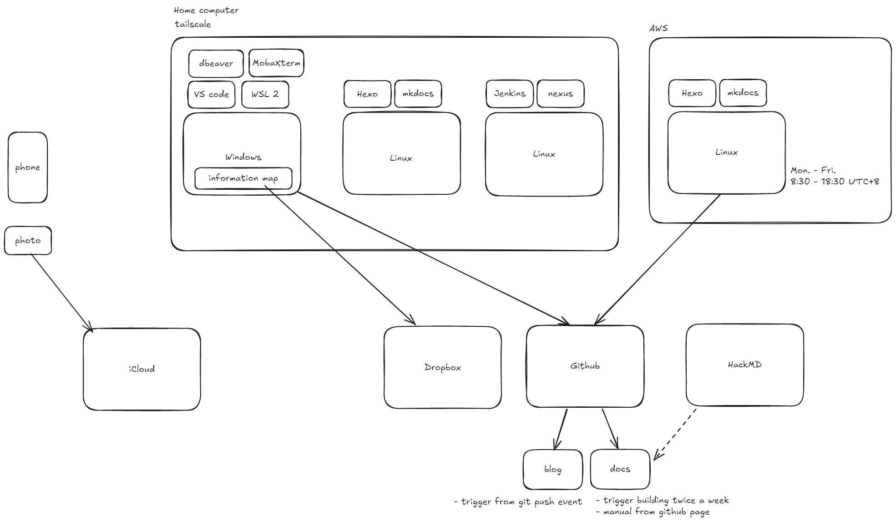

# information_system

Follow the [Conventional Commits](https://www.conventionalcommits.org/en/v1.0.0/)



## Single source of truth
- git
    - https://github.com/j2hongming
    - git hosting services, ex. Github, Gitlab, Bitbucket, AWS CodeCommit...
- storage
    - for files, photos, images, document(Word, Excel...)
    - Dropbox
    - Google Drive
    - Microsoft OneDrive

## Windows host
- [Developing on Remote Machines using SSH and Visual Studio Code](https://code.visualstudio.com/docs/remote/ssh#_getting-started)

### Tools
- visual studio code
    -  Remote-SSH extension
        - if there is no ssh client on the windows, download [Win32-OpenSSH](https://github.com/PowerShell/Win32-OpenSSH/releases), extract it and add PATH
        - config host, ex. `C:\ProgramData\ssh\ssh_config`


## Linux host
### initialization
#### git config
``` bash
bash configure_git.sh
```

#### ssh key pair
- [Generating a new SSH key and adding it to the ssh-agent - GitHub Docs](https://docs.github.com/en/authentication/connecting-to-github-with-ssh/generating-a-new-ssh-key-and-adding-it-to-the-ssh-agent)

``` bash
ssh-keygen -t ed25519 -C "your_email@example.com"
```

### optional
#### pyenv
- [pyenv/pyenv: Simple Python version management](https://github.com/pyenv/pyenv)

``` bash
bash configure_pyenv.sh
```

``` bash
pyenv install -l
pyenv install 3.10.4
pyenv virtualenv <venv_name>
pyenv virtualenvs
pyenv activate <venv_name>
pyenv deactivate
pyenv virtualenv-delete <venv_name>
```