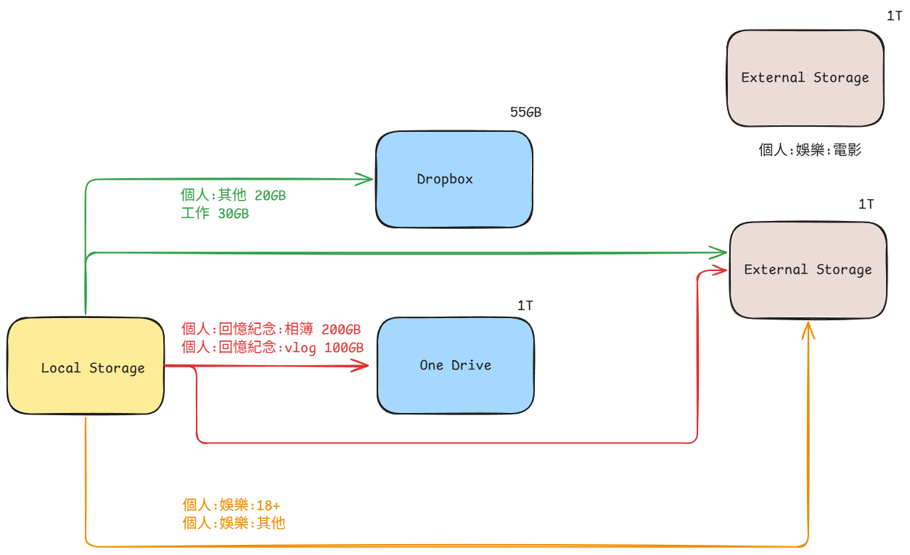

# 數位地圖

## version 1
root By 角色
個人/貓咪/父母/小孩/工作者

priority 1: 回憶紀念, 財務, 房屋, 檢測報告

- 個人
    - 身分
        - 身分證件
        - 護照
    - 財務
        - 合約
        - 收據
        - 報稅
        - 房貸
        - 投資
        - 補助申請
    - 房屋
    - 檢測報告
        - 健康檢查
        - 性向測驗
    - 生活
    - 課程
    - 回憶紀念
        - vlog(harry potter/ cat)
        - 相簿
    - 娛樂
        - 音樂
        - 電影
        - 劇集
        - 遊戲
        - 動畫
        - 漫畫
        - 18+
    - 素材
    - 封存
        - 說明書
        - 名片
        - 旅行
        - 報名資訊(馬拉松)
        - 資料備份(By APP/Software/line) (notes by hackmd)
        - 單機軟體

- 工作(者)
    - 職涯
        - 履歷
        - 證書
        - {公司名稱}
    - 專業
        - 軟體工程
            - 計算
            - 儲存
            - 傳輸
            - 安全
            - 程式語言
    - 專案
    - 課程

### Backup strategy


Local Storage
- D:\Dropbox\個人
- D:\Dropbox\工作
- D:\OneDrive\j2hongming\回憶紀念
- D:\j2hongming\Pictures\iCloud Photos\Photos
- D:\j2hongming\Documents\iCloudDrive

Local Storage to External Storage
``` bash
rsync -avzh --progress /mnt/d/OneDrive/j2hongming/回憶紀念/ /mnt/e/j2hongming/個人/回憶紀念/

rsync -avzh --progress /mnt/d/Dropbox/ /mnt/e/j2hongming/
# rsync -avzh --progress /mnt/d/Dropbox/個人/ /mnt/e/j2hongming/個人/
# rsync -avzh --progress /mnt/d/Dropbox/工作/ /mnt/e/j2hongming/工作/
```